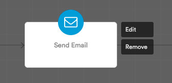

# Actions

Actions are just what they mean: actions. You can find the list of actions in the Automation Components drawer on the right side of the builder.

Simply drag and drop the action you want to add in the path of your automation.

You'll then be asked to configure the action you've just added.

You can edit the configuration for an action or remove it simply by clicking on it.

