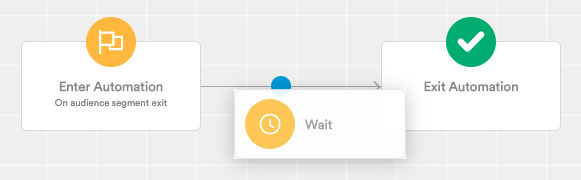

# Flow control

Flow control components let you alter the natural flow of an automation. You can find the list of flow control components in the Automation Components drawer on the right side of the builder.

Simply drag and drop the component you want to add in the path of your automation.

You'll then be asked to configure the component you've just added.

You can edit the configuration for a component or remove it simply by clicking on it.

