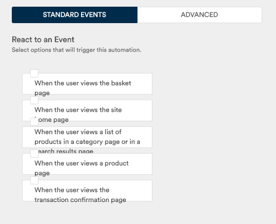
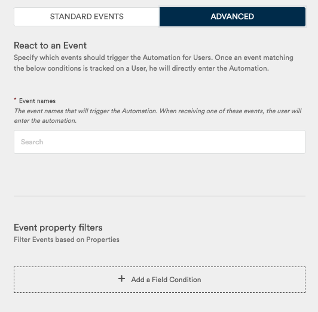

# React to an event

If you choose "React to an event" as the trigger for your automation, the automation will be triggered each time a user causes a specified event.

The configuration will allow you to specify which events should trigger this automation:

In the Advanced view, you can also add field conditions, for instance if you want to trigger your automation only with events taking place after a certain date, ...

