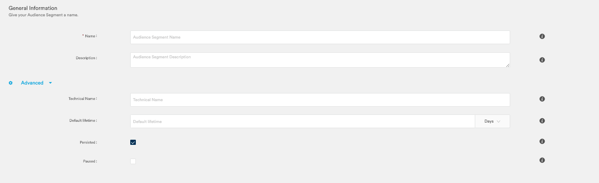

# User query segment

## **Manage your segmentation criteria, operators and logics**

You can start in two ways by creating a new Object or Group:

Let’s start with an Object. An object is one of the the audience criteria directly linked to you schema

Once you selected one you can add sub-criteria called field conditions:

You can add a frequency by clicking on the check box. For example, in the case you want to create a segment of user points who have visited the website at least 3 times. 

You can also add field conditions to make more advanced queries by clicking on   
“Add a Field Condition” :

Once you are satisfied with you object conditions you can click on Update and visualize your query 

You can also refresh the number of UserPoint to check the volume corresponding to your query in real time

All data stored and indexed according to your schema is available for querying and forecasting your audience in real time. This means that mediarithmics does not aggregate data meaning your segment will not need for its visitors to come back a second time to be calculated.

You can explore further queries by adding group conditions when clicking on the “+” and then Group button.

These group conditions can be modified to include, exclude and manage “and” / “or” audience groups.

## **Refresh audience stats and validate your audience**

You can then save your audience as a segment by clicking on ”Save as”, name your audience and save it:

Your newly created segment will then be immediately available in the Audience/Segments menu.

**By clicking on Advanced, you can edit five fields:**

* Segment name \(mandatory\) : the name under which your segment will appear in your catalogue
* The technical name \(optional\) : the name used for integrations. If left empty, the platform will assign one
* The default lifetime \(optional\) : the duration of calculation in days, once expired, the segment is not calculated. If left empty, it is calculated for ever
* Persisted \(mandatory\) : when unticked, the segment is not persisted meaning it is not calculated and only used for statistical counts. When ticked, the segment is calculated at all time and can be used for sending your segment to an external partner \(Google, Appnexus, etc.\). All segments are ticked and therefore persisted by default
* Paused: when ticked, the segment is not calculated and cannot be used for Analytics purposes.

